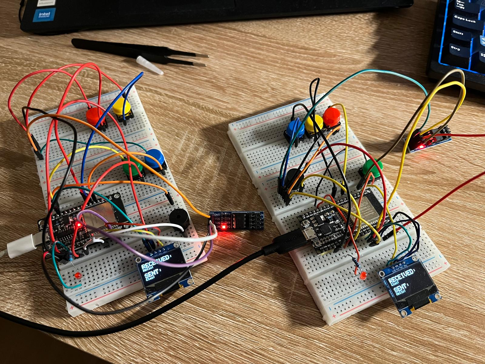

# 📡 ESP32 Wireless Communication Device

---

## 📖 Overview

This project implements a compact wireless communication system using two ESP32 microcontrollers.  
The devices communicate directly using the **ESP-NOW protocol**, enabling fast, low-power, peer-to-peer messaging without requiring a Wi-Fi network or internet connection.

The system is designed as a portable communication device, similar to a minimal walkie-talkie, enhanced with **Morse code input*.

---

## 🧰 Hardware Components

Each device is equipped with:

- 📺 SSD1306 OLED display (128x64) for real-time message visualization  
- 🔘 Push buttons (2x) for Morse code input  
- 🔊 Buzzer for audio notifications  
- 💡 LED for visual feedback  
- 📡 ESP32 microcontroller  

---

## 🚀 Features

### 📡 ESP-NOW Communication
- Sends and receives messages instantly  
- No router, Wi-Fi network, or internet required  

### 🖥️ Real-Time Display
- Incoming and outgoing messages are displayed on the OLED screen  

### 🧠 Morse Code Input System (NEW)
- Enter **writing mode** by pressing both buttons simultaneously  
- Use:
  - 🔘 Button 1 → DOT (·)  
  - 🔘 Button 2 → DASH (−)  
- Morse sequences are automatically translated into readable text  
- Enables flexible message composition without a keyboard  

### 🎮 User Interaction
- Dual-button interface for input and mode switching  

### 🔔 Feedback System
- LED and buzzer activate upon message reception  

### 🎬 Startup Animation
- Custom bitmap icons displayed during boot  

---

## ⚙️ How It Works

- ESP32 operates in **WIFI_STA mode** and initializes ESP-NOW  
- Devices are paired using each other's MAC addresses  

### ✍️ Writing Mode (Morse)
1. Press both buttons → enter writing mode  
2. Input Morse code:
   - DOT (short press button 1)  
   - DASH (short press button 2)  
3. Pause → character is decoded  
4. Text builds automatically on display  

### 📤 Sending
- Completed message is sent via ESP-NOW  

### 📥 Receiving
- Message is received via callback  
- Buzzer and LED are triggered  
- Message is displayed on the OLED  

---

## 🧠 Technologies Used

- ESP32 (Arduino framework)  
- ESP-NOW wireless protocol  
- I2C communication (OLED display)  
- Adafruit GFX & SSD1306 libraries  

---

## 📸 Startup Logo & Device Prototype

  

  

---

## 🔧 Possible Future Improvements (Contributions are Welcome!)

### 🧑‍💻 Software
- ⌨️ Predictive text for Morse input  
- 📋 Menu-based UI (**U8g2**)  
- 💾 Message history (EEPROM / SPIFFS)  
- 🔒 Encrypted ESP-NOW communication  
- 🔋 Power optimization & sleep modes  

### 🔌 Hardware & PCB
- 🧩 Custom PCB  
- 📦 Compact enclosure  
- 🔋 Battery charging circuit  

### 📍 Advanced Features
- 📡 GPS location sharing  
- 📷 ESP32-CAM integration  
- 🎤 Voice messages  
- 🔊 Speaker playback  

---

## 📡 Use Cases

- 📡 Walkie-talkie style communication  
- 🌍 Offline communication in remote areas  
- 🚨 Emergency communication system  
- 🎓 Embedded systems project  

---

## ⚡ Getting Started

1. Install Arduino IDE  
2. Install required libraries:
   - Adafruit GFX  
   - Adafruit SSD1306  
3. Clone repository  
4. Upload code to both ESP32 devices  
5. Set peer MAC addresses  
6. Connect components  
7. Power devices  
8. Open Serial Monitor (115200 baud)  

---

## 💡 Project Vision

This project evolves into a fully standalone **portable communication device**, combining Morse-based input, wireless messaging, and future AI-assisted interaction in a compact embedded system.
